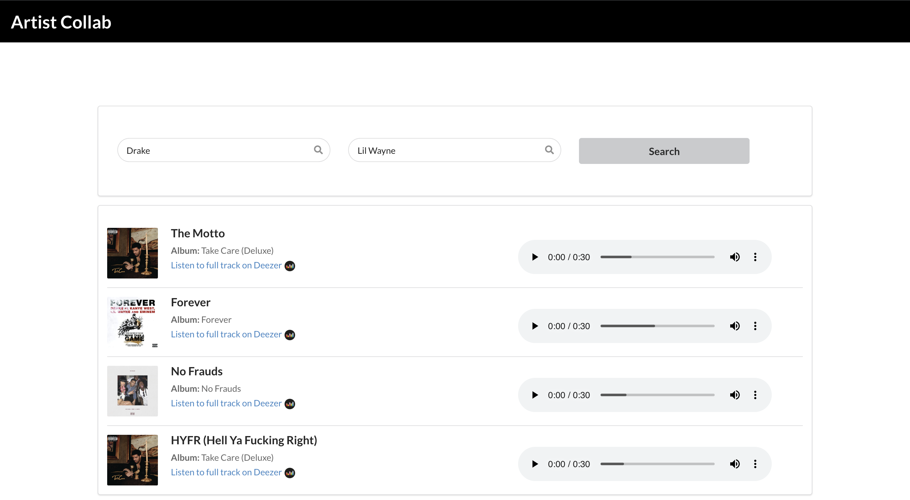

# artist-collab
Find songs artists have collaborated on


# Welcome to push-history (WIP) 🚧


> A chrome extension for searching through your Pushbullet history

## Install
Clone repo

```sh
npm install
```

## Usage
Run Client (Dev): `npm run dev:app` 
Build Client: `npm run build:app` 

Run Server (Dev): `npm run dev:server` 
Run Server: `npm run start:server` 

## Screenshots


### TODO 🚧
* Caching search queries
* Spice up UI
* Fix Bugs

## Author

👤 **Kenneth Thuku <thuku.ken@live.com>**

* Github: [@ktkization](https://github.com/ktkization)


